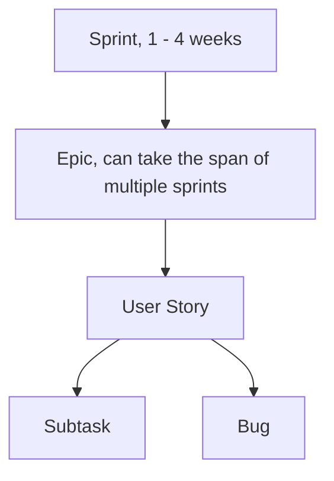

# 🔄 Scrum Guide

## What is Scrum?
Scrum is a subset of Agile. It is a lightweight process framework for agile development, and the most widely-used one.
A "process framework" is a particular set of practices that must be followed in order for a process to be consistent with the framework. (For example, the Scrum process framework requires the use of development cycles called Sprints, the XP framework requires pair programming, and so forth.)
"Lightweight" means that the overhead of the process is kept as small as possible, to maximize the amount of productive time available for getting useful work done.

A Scrum process is distinguished from other agile processes by specific concepts and practices, divided into the three categories of Roles, Artifacts, and Time Boxes. Scrum is most often used to manage complex software and product development, using iterative and incremental practices. Scrum significantly increases productivity and reduces time to benefits relative to classic "waterfall" processes. Scrum processes enable organizations to adjust smoothly to rapidly-changing requirements, and produce a product that meets evolving business goals.

## Scrum Workflow

## Resources
> I recommend reading these. 
- [Agile With Jira](https://www.atlassian.com/agile/tutorials)
    - Click learn Scrum with Jira
- [Scrum Poker | Planning Poker with Jira](https://marketplace.atlassian.com/apps/1212495/planning-poker?hosting=cloud&tab=overview) 

## Core Scrum Concepts

### Sprints
Sprints are the heartbeat of Scrum. They are fixed-length events, typically 1-4 weeks long, where a team works to complete a set amount of work. The goal is to create a done, usable, and potentially releasable product increment. Each Sprint starts with a planning session and ends with a review and retrospective.

#### What Happens to Unfinished Stories?
You're on the right track! It's a common question. If a user story is not finished by the end of a sprint, it is not partially done—it's simply "Not Done."

The unfinished story is moved back to the Product Backlog. It is then re-prioritized by the Product Owner. If the story is still important and a top priority, it will be considered for inclusion in the next Sprint during the next Sprint Planning meeting. So, while it often moves to the next sprint, it's not automatic. The team will also re-estimate the remaining work for that story. This ensures that the most valuable work is always being prioritized.

### Epics
An Epic represents a large body of work that can be broken down into smaller, more manageable items called User Stories. Think of an Epic as a major feature or a large project requirement. For example, "Implement User Authentication" could be an Epic. Because of their size, epics are delivered over several sprints.

### User Stories
A User Story is a short, simple description of a feature told from the perspective of the end-user. 
It's the smallest unit of work in Scrum and describes what a user wants and why. [The typical format is this](/docs/agile/scrum-guide/user-story)

