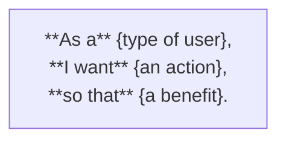

# 📖 User Story

```mermaid
graph TD
A[**As a** #123;type of user#125;,<br> **I want** #123;an action#125;,<br> **so that** #123;a benefit#125;.]

```

For example: "As a user, I want to log in with my email and password so that I can access my profile."