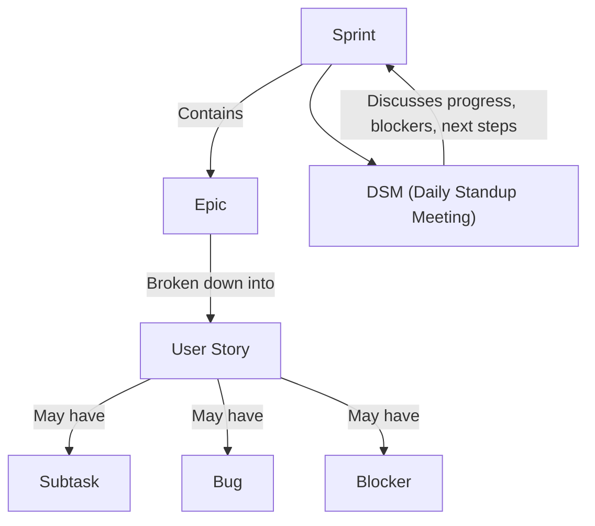

# Jira

## Introduction to Our Work Environment

### For Developers

#### What is Agile?
Agile is a philosophy and approach to software development that emphasizes flexibility, collaboration, and customer feedback. It encourages iterative progress, where teams deliver small, workable pieces of software frequently and adapt to changes quickly.  
[Learn more about Agile in this documentation section.](employee documentation link)

#### What is Scrum?
Scrum is a popular Agile framework that organizes work into fixed-length iterations called sprints. It defines specific roles (like Scrum Master, Product Owner, and Developers) and ceremonies (like Daily Standups, Sprint Planning, and Retrospectives) to help teams deliver value efficiently.

---

### Navigating Jira: UI/UX Guide

Jira is our primary tool for managing Agile projects. Here's a quick guide to its main features:

- **Dashboard:** Your starting point, showing assigned tasks, project status, and notifications.
- **Backlog:** Where all user stories, tasks, and bugs are listed and prioritized.
- **Active Sprint Board:** Visualizes current sprint tasks, typically in columns like To Do, In Progress, and Done.
- **Issue View:** Detailed page for each task, showing description, comments, status, assignees, and related subtasks.

---

### Key Jira Concepts

- **Sprints:** Time-boxed periods (usually 1-2 weeks) where the team works to complete a set of tasks.
- **Epics:** Large bodies of work that can be broken down into smaller tasks (user stories).
- **User Stories:** Short, simple descriptions of a feature or requirement from the user's perspective.
- **Blockers/Bugs/Subtasks:**  
  - **Blockers:** Issues preventing progress on a task.
  - **Bugs:** Problems or errors in the product that need fixing.
  - **Subtasks:** Smaller tasks that break down a user story or bug.
- **DSM (Daily Standup Meeting):** A daily meeting where each team member quickly shares what they did yesterday, what they plan to do today, and any blockers.

#### Visual Overview



---

### Jira/Slack Ethics

When communicating updates in Jira or Slack, please follow our etiquette:

#### General Guidelines
- **Be clear and concise:** State your message directly and avoid unnecessary jargon.
- **Reference relevant issues:** Always mention the user story, task, or bug number.
- **Notify the right people:** Use @mentions or cc the relevant team members (QA, Scrum Master, etc.).
- **Be respectful and professional:** Maintain a positive and constructive tone.
- **Provide context:** Briefly explain what was done, what is needed, or what is blocking you.
- **Use appropriate channels:** Post in the correct Slack channel or Jira comment thread.

#### Example: Daily Update
```
Hi good afternoon team!,

Passed QA testing User Story #- 179800: [Teacher] Allow multiple quiz attempts

Pushed to {branchName}, ready for peer testing

Thank you!
cc Mr {QATester}, Mr {ScrumMaster}
```

#### Example: Reporting a Blocker
```
Hello team,

I'm currently blocked on User Story #- 180102: [Student] Submit assignment feature due to API timeout errors.

Awaiting backend team support to resolve the issue.

Thank you!
cc @backend-team, Mr {ScrumMaster}
```

#### Example: Requesting Code Review
```
Hi @reviewer,

I've completed the implementation for Bug #- 180210: [Admin] Dashboard loading issue.

Could you please review the changes in the `bugfix/dashboard-loading` branch?

Thank you!
```

#### Example: Updating on Bug Fix
```
Hi team,

Bug #- 180305: [Teacher] Unable to upload files has been fixed and deployed to staging.

Please verify and let me know if further action is needed.

Thanks!
cc @QA-team
```

[Read more about our Jira/Slack communication standards.](docs link here) 

